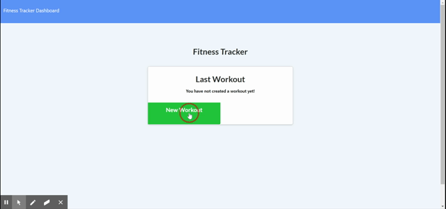

# Fitness Tracker

Fitness Tracker, an app that allows user to log their exercise and keep track of their progress. Fitness Tracker allows user to add workout or continue workout. With Fitness Tracker user can have the choice to log either resistance or cardio exercise. Besides that the user can also log detail such as duration, weight, reps, and sets.

## Built With

- [HTML](https://developer.mozilla.org/en-US/docs/Web/HTML)
- [CSS](https://developer.mozilla.org/en-US/docs/Web/CSS)
- [Javascript](https://developer.mozilla.org/en-US/docs/Web/JavaScript)
- [Node.js](https://nodejs.org/en/)
- [Express.js](https://expressjs.com/)
- [MongoDB](https://docs.mongodb.com/manual/)
- [mongoose](https://www.npmjs.com/package/mongoose)

## Installation Guide

First navigate to your terminal and clone the repository(https://github.com/kokevin678/workout_tracker.git). Then install the dependencies in terminal by typing in "npm install". Run server in terminal by typing in "node server.js".

## Demo



## Code Snippets

Create an exercise using PUT request, which updates the workout base on the unique ID. Using $push to append the exercise ID, $inc to update total duration of the workout and set new option to true to return the document after update is applied.

```js
app.put("/api/workouts/:id", (req, res) => {
  db.Exercise.create(req.body)
    .then(data =>
      db.Workout.findOneAndUpdate(
        { _id: req.params.id },
        {
          $push: {
            exercises: data._id
          },
          $inc: {
            totalDuration: data.duration
          }
        },
        { new: true }
      )
    )
    .then(dbWorkout => {
      res.json(dbWorkout);
    })
    .catch(err => {
      res.json(err);
    });
});
```

## Deployed Link

- [See Live Site](https://stormy-earth-42697.herokuapp.com/)

## Authors

**Kevin Ko**

- [LinkedIn](https://www.linkedin.com/in/kevin-ko-ab7a98196/)
- [Github](https://github.com/kokevin678)
- [Portfolio](#)
